<h1 align="center">Atelier Field</h1>

<p align="center">Procedural SVG drawings for a specified width and height, in PHP.</p>

<p align="center">
  
  
  
  <a href="LICENSE"></a>
</p>

Generate landscapes, contours, partitions, flows, and density fields for a given canvas.
Each drawing uses the requested width and height; some fill the viewport, while others leave
transparent space between their shapes.

```php
use Atelier\Field\Field;

echo Field::waves(1200, 400, layers: 6, seed: 7)->withColor('#cf4d9b')->toSvg();
```

<p align="center">
  
  
</p>

A field is an immutable drawing generated for one viewport. It produces standalone SVG,
exports a CSS background, or supplies a group for an Atelier SVG document. For a surface that
repeats, use the companion `atelier/pattern` package.

**[Colour](#colour) · [Catalogue](#catalogue) · [Errors](#error-handling) · [Gallery](#gallery) · [Documentation](#documentation)**

## Installation

```bash
composer require atelier/field
```

Requires PHP 8.3+ and `atelier/svg`. Seeded generators use `ext-random`, bundled with PHP.
Composer installs the package dependencies.

## Quick start

```php
<?php

declare(strict_types=1);

use Atelier\Field\Field;

require __DIR__.'/vendor/autoload.php';

echo Field::waves(1200, 400, layers: 6, seed: 7)
    ->withColor('#0067a0')
    ->toSvg();
```

The following snippets reuse the imports and autoloader above. To append the drawing to an
existing document:

```php
$document->getRootElement()?->appendChild(
    Field::waves(1200, 400)->element()
);
```

Or take it as a CSS background:

```php
echo Field::waves(1600, 500)->withColor('#0067a0')->toCss();
```

A background image is a document of its own, so `currentColor` resolves to black there. Set a
real colour before calling `toDataUri()` or `toCss()`.

## Colour

Factories take geometry and, for seeded generators, a seed. Colour applies afterwards and
returns a new field each time.

```php
Field::waves(1200, 400)
    ->withColor('#0067a0')
    ->withBackground('#f6f5f1')
    ->withOpacity(0.6);
```

The default foreground is `currentColor` and no ground is painted, so one drawing follows the
colour of its ancestors when used as inline SVG.

For a coordinated foreground, background, and palette, use a theme:

```php
use Atelier\Field\Theme;

Field::waves(1200, 400)->withTheme(Theme::blueprint());
```

A nonempty palette takes precedence over the foreground for toned fills. `withColor()` changes
only the foreground; it does not replace palette entries. Without a palette, layers use one
colour at different opacities. See [Colour](docs/getting-started.md#colour-it).

## Catalogue

<table>
  <tr>
    <td align="center" width="33%">
      <a href="docs/fields/waves.md"><br>Waves</a>
    </td>
    <td align="center" width="33%">
      <a href="docs/fields/dunes.md"><br>Dunes</a>
    </td>
    <td align="center" width="33%">
      <a href="docs/fields/strata.md"><br>Strata</a>
    </td>
  </tr>
  <tr>
    <td align="center" width="33%">
      <a href="docs/fields/mountains.md">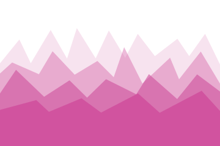<br>Mountains</a>
    </td>
    <td align="center" width="33%">
      <a href="docs/fields/skyline.md">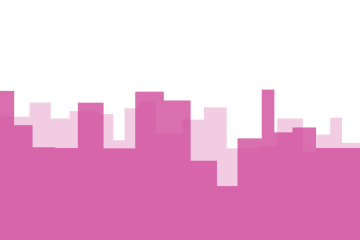<br>Skyline</a>
    </td>
    <td align="center" width="33%">
      <a href="docs/fields/cloud.md"><br>Cloud</a>
    </td>
  </tr>
  <tr>
    <td align="center" width="33%">
      <a href="docs/fields/blob.md">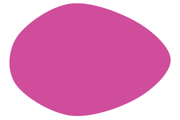<br>Blob</a>
    </td>
    <td align="center" width="33%">
      <a href="docs/fields/contours.md">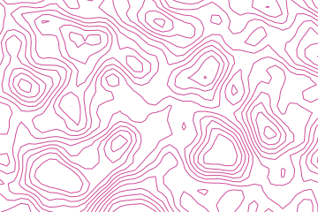<br>Contours</a>
    </td>
    <td align="center" width="33%">
      <a href="docs/fields/archipelago.md"><br>Archipelago</a>
    </td>
  </tr>
  <tr>
    <td align="center" width="33%">
      <a href="docs/fields/low-poly.md"><br>Low poly</a>
    </td>
    <td align="center" width="33%">
      <a href="docs/fields/voronoi.md">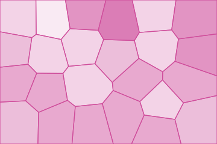<br>Voronoi</a>
    </td>
    <td align="center" width="33%">
      <a href="docs/fields/foam.md">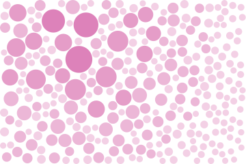<br>Foam</a>
    </td>
  </tr>
  <tr>
    <td align="center" width="33%">
      <a href="docs/fields/flow-field.md">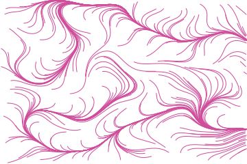<br>Flow field</a>
    </td>
    <td align="center" width="33%">
      <a href="docs/fields/terrain.md"><br>Terrain</a>
    </td>
    <td align="center" width="33%">
      <a href="docs/fields/halftone.md">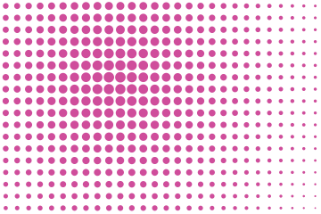<br>Halftone</a>
    </td>
  </tr>
  <tr>
    <td align="center" width="33%">
      <a href="docs/fields/moire.md">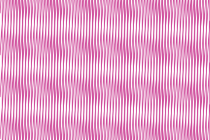<br>Moire</a>
    </td>
    <td align="center" width="33%">
      <a href="docs/fields/wave-interference.md">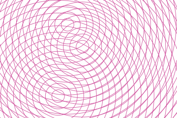<br>Wave interference</a>
    </td>
    <td align="center" width="33%">
      <a href="docs/fields/rays.md">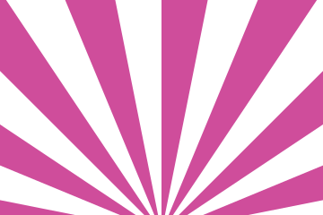<br>Rays</a>
    </td>
  </tr>
</table>

## Error handling

Width and height must be finite and greater than zero. Invalid dimensions or generator options
throw `Atelier\Field\Exception\InvalidArgumentException`. All package exceptions implement
`Atelier\Field\Exception\ExceptionInterface`.

See [Input limits](docs/getting-started.md#input-limits) for validation examples and the
[viewport and precision limits](docs/getting-started.md#viewport-coverage-and-resizing) before
using extreme dimensions or sampling settings.

## Gallery

```bash
composer gallery
```

Writes `examples/output/index.html`.

## Documentation

- [Getting started](docs/getting-started.md): install the package and produce a first SVG.
- [Illustrated catalogue](docs/fields/index.md): choose a field and explore its parameters.
- [Package overview](docs/index.md): understand the API and its boundaries.

Read the complete guides and generated illustrations in [docs/](docs/).

## Contributing

Contributions are welcome. Visit the [project on GitHub](https://github.com/ateliersvg/field)
to [report a bug](https://github.com/ateliersvg/field/issues/new),
[suggest a feature](https://github.com/ateliersvg/field/issues/new), or
[open a pull request](https://github.com/ateliersvg/field/pulls).

Before submitting code, run:

```bash
composer qa
composer coverage
```

Changes to public behaviour need tests and a documentation update.
Keep line coverage at 100%. Coverage reporting requires PCOV or Xdebug.

## Support

Bug reports, security disclosures, and contribution guidelines are collected at
[ateliersvg.com/support](https://ateliersvg.com/support/).

## License

Atelier Field is released under the [MIT License](LICENSE).
