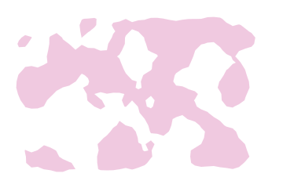
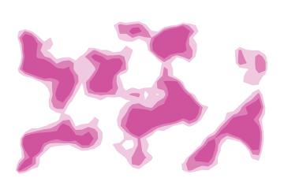

# Archipelago

The same marching squares `contours` draws as open lines, filled instead: land above
one altitude, then above the next, then above the next.

Filling needs closed rings, and a ring only closes if the height field never crosses the border of
the frame. A window that brings the field down to nothing along every edge guarantees it. That
window is also what puts water around the archipelago rather than cutting an island in half at
the frame.


## Example

```php
<?php

declare(strict_types=1);

use Atelier\Field\Field;

require __DIR__.'/vendor/autoload.php';

echo Field::archipelago(width: 360, height: 240, cell: 8, levels: 3, seed: 1)->toSvg();
```

The figures use this 360 by 240 example and its explicit seed. Only the display colour
is changed to the documentation accent. Each variant changes only the setting in its caption.

## Options

| Setting | Default | Effect |
|---|---|---|
| `width` | none | area to cover, in user units |
| `height` | none | area to cover, in user units |
| `cell` | `8` | distance between two samples of the height field, at most a quarter of the smaller side |
| `levels` | `3` | coasts drawn, 1 to 6 |
| `seed` | `1` | the height field the coasts are read off |
| `withTheme(Theme)` | `Theme::default()` | colours, in one call |
| `withColor(string)` | `currentColor` | the ink the islands are painted with |
| `withBackground(?string)` | none | a ground behind the drawing, which reads as the water |

Each level is one path holding every ring it owns, filled even odd, so a lagoon inside an island
is a hole rather than a second island drawn on top of the first.

## Variants

One setting moved, the rest held: `levels` slices the relief, `cell` samples it, `seed` draws it.

<div class="figure-grid figure-grid--notes">
<figure><figcaption><code>levels: 1</code>. One coast. The islands come back as flat shapes, which is the map before the relief is added to it.</figcaption></figure>
<figure><figcaption><code>cell: 12</code>. A sampling step of 12 instead of 8, 1.5 times coarser. Small features can be lost between samples.</figcaption></figure>
<figure><figcaption><code>seed: 5</code>. Another height field sampled at the same three thresholds.</figcaption></figure>
</div>

## Why the water is empty

Nothing is painted for the sea. The lowest level is the shoreline and everything below it is left
to the surface underneath, so a field dropped on a page takes the colour of that page as its
water.

`withBackground()` fills it when the drawing has to stand on its own, and the ground is drawn
behind every level so the islands keep reading in order.
