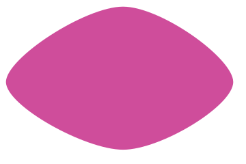
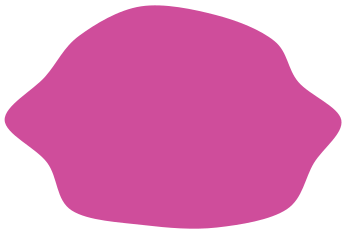
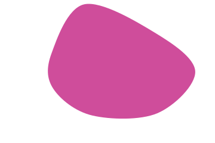

# Blob

The radius is drawn at a handful of angles and the points are joined by a Catmull-Rom spline
written out as cubic beziers, so the curve passes through every one of them and its tangents
match on both sides.


## Example

```php
<?php

declare(strict_types=1);

use Atelier\Field\Field;

require __DIR__.'/vendor/autoload.php';

echo Field::blob(width: 360, height: 240, nodes: 7, irregularity: 0.28, seed: 1)->toSvg();
```

The figures use this 360 by 240 example and its explicit seed. Only the display colour
is changed to the documentation accent. Each variant changes only the setting in its caption.

## Options

| Setting | Default | Effect |
|---|---|---|
| `width` | none | area to cover, in user units |
| `height` | none | area to cover, in user units |
| `nodes` | `7` | points the curve passes through, 3 to 24 |
| `irregularity` | `0.28` | how far a radius may leave the mean, `[0,1)` |
| `seed` | `1` | the shape |

The radius is read against the half width and half height separately, which is what lets a blob
fill a frame that is not square instead of sitting in the middle of it as a disc.

Angles are spaced evenly rather than drawn, so a blob never grows a pinch where two nodes happen
to land together. What varies is the reach at each angle, and that is enough.

## Variants

One setting moved, the rest held: `nodes` is how many turns the curve makes, `irregularity` is how far a radius may fall.

<div class="figure-grid figure-grid--notes">
<figure><figcaption><code>nodes: 4</code>. Four nodes. The curve still closes on the same tangent, with just enough freedom to stop being an ellipse.</figcaption></figure>
<figure><figcaption><code>nodes: 14</code>. Fourteen nodes. Each one pulls a shorter arc, so the outline gains lobes instead of growing.</figcaption></figure>
<figure><figcaption><code>irregularity: 0.6</code>. Radii are drawn between one and one minus the irregularity, and never above one, which keeps the curve inside the frame. More freedom therefore also pulls the mean radius in, so the shape comes out smaller as well as rougher.</figcaption></figure>
</div>

## Why a spline

Joining the nodes with arcs leaves a corner wherever two arcs meet, which is what makes a
hand-rolled blob read as a flower. A Catmull-Rom spline matches the tangents on both sides of
every node, so the outline carries no corner at all.

The first point is reused as the last, so the seam closes with the same tangent as any other
node and cannot be found by looking.
