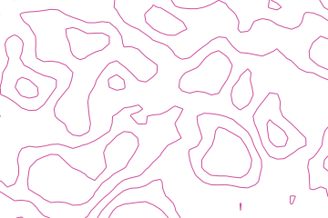
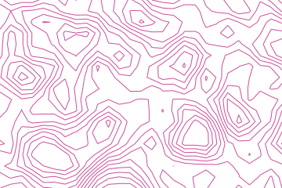
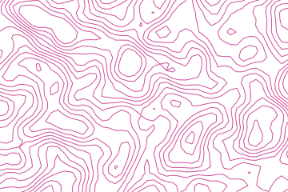

# Contours

A height is sampled on a lattice and each cell is cut by marching squares: the four corners are
compared to a level, the case says which edges the line crosses, and the crossing is placed by
interpolating between the two corner heights.


## Example

```php
<?php

declare(strict_types=1);

use Atelier\Field\Field;

require __DIR__.'/vendor/autoload.php';

echo Field::contours(width: 360, height: 240, cell: 8, levels: 12, seed: 1)->toSvg();
```

The figures use this 360 by 240 example and its explicit seed. Only the display colour
is changed to the documentation accent. Each variant changes only the setting in its caption.

## Options

| Setting | Default | Effect |
|---|---|---|
| `width` | none | area to cover, in user units |
| `height` | none | area to cover, in user units |
| `cell` | `8` | distance between two samples, at most a quarter of the smaller side |
| `levels` | `12` | isolines between the low and the high ground, 1 to 40 |
| `thickness` | `1` | line width |
| `seed` | `1` | the relief the lines follow |

One path carries one level, so a level can be toned as a whole and a reader follows a single
line around the frame.

Levels sit inside the range rather than on its ends, where an isoline would either vanish or
trace the border of the frame.

## Variants

One setting moved, the rest held: `levels` slices the relief, `cell` samples it, `seed` draws it.

<div class="figure-grid figure-grid--notes">
<figure><figcaption><code>levels: 4</code>. Four height thresholds instead of twelve. A threshold produces no line where the relief never crosses it.</figcaption></figure>
<figure><figcaption><code>cell: 14</code>. The same twelve thresholds sampled at a step of 14 instead of 8. Fewer samples give straighter runs.</figcaption></figure>
<figure><figcaption><code>seed: 5</code>. Another relief sampled at the same twelve thresholds.</figcaption></figure>
</div>

## Why the interpolation matters

Placing a crossing at the middle of its edge costs nothing to write, and it gives every isoline
the same set of 45 degree corners. The drawing then reads as a lattice artefact rather than as
terrain, and no amount of extra levels hides it.

Interpolating between the two corner heights puts the crossing where the level actually falls.
The lines curve, they stop meeting at the same angles, and the lattice disappears behind the
relief it was sampling.

A test counts how many points land on a half step. Above one in fifty, the staircase is back.
