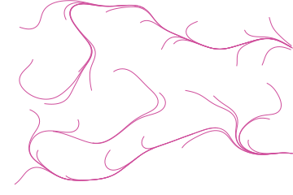
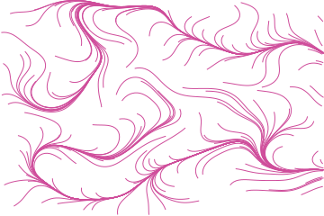
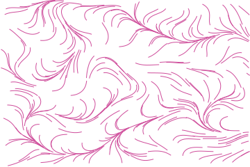

# Flow field

A noise field gives an angle at every point. A line starts somewhere and walks, turning to
whatever the field says at each step, until it leaves the frame or runs out of length.
Neighbouring lines read the same angles, so they travel together without ever being told to.


## Example

```php
<?php

declare(strict_types=1);

use Atelier\Field\Field;

require __DIR__.'/vendor/autoload.php';

echo Field::flowField(width: 360, height: 240, lines: 260, length: 60, seed: 1)->toSvg();
```

The figures use this 360 by 240 example and its explicit seed. Only the display colour
is changed to the documentation accent. Each variant changes only the setting in its caption.

## Options

| Setting | Default | Effect |
|---|---|---|
| `width` | none | area to cover, in user units |
| `height` | none | area to cover, in user units |
| `lines` | `260` | starts spread over the frame, 1 to 2000 |
| `length` | `60` | steps a line walks before it stops, 2 to 400 |
| `thickness` | `1` | line width |
| `seed` | `1` | the current the lines follow |

Fewer lines and a longer walk gives a drawing of a few long currents. More lines and a shorter
walk gives a texture. The two knobs are worth turning together, since their product is roughly
how much ink lands on the frame.

## Variants

One setting moved, the rest held: `lines` is how many currents start, `length` is how far each one walks.

<div class="figure-grid figure-grid--notes">
<figure><figcaption><code>lines: 30</code>. Thirty starts instead of 260. The current is easier to follow line by line.</figcaption></figure>
<figure><figcaption><code>lines: 160</code>. 160 starts, fewer than the 260 in the overview. Starts that leave immediately are omitted.</figcaption></figure>
<figure><figcaption><code>length: 12</code>. The same 260 starts, each allowed twelve steps instead of sixty.</figcaption></figure>
</div>

## Covering the frame

Starts are spread one per cell of a lattice rather than thrown anywhere. A uniform scatter
leaves bald patches on a frame this size, and a bald patch on a drawing whose whole subject is a
current reads as a mistake.

Walking stops before the first step outside the frame, so the last sample may fall short of
the border. This generator does not interpolate a final intersection. A start leaving at its
first step is dropped. Stroke edges can extend beyond their in-bounds centreline.
