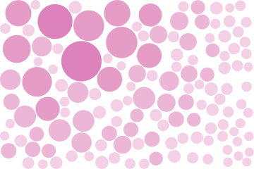
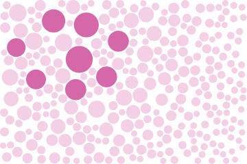
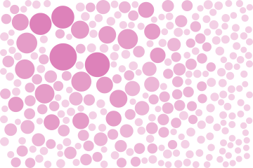

# Foam

Discs thrown at random, each one grown until it meets its nearest neighbour or an edge, and kept
if it is still worth drawing. Later discs take the gaps the earlier ones left, and that is where
the long tail of sizes comes from: a packing looks nothing like a scatter of equal dots.

The target size falls away from one point, and that gradient is what makes it a field.
`halftone` varies a radius on a lattice; here the lattice is gone as well.


## Example

```php
<?php

declare(strict_types=1);

use Atelier\Field\Field;

require __DIR__.'/vendor/autoload.php';

echo Field::foam(width: 360, height: 240, radius: 22, focusX: 0.3, focusY: 0.28, seed: 1)->toSvg();
```

The figures use this 360 by 240 example and its explicit seed. Only the display colour
is changed to the documentation accent. Each variant changes only the setting in its caption.

## Options

| Setting | Default | Effect |
|---|---|---|
| `width` | none | area to cover, in user units |
| `height` | none | area to cover, in user units |
| `radius` | `22` | radius of the largest disc, at most a fifth of the smaller side |
| `focusX` | `0.3` | where the largest discs stand across the frame, `[0,1)` |
| `focusY` | `0.28` | where the largest discs stand down the frame, `[0,1)` |
| `tones` | `5` | tones the discs are shaded with, 2 to 24 |
| `seed` | `1` | the throws, and so the packing |
| `withTheme(Theme)` | `Theme::default()` | colours, in one call |
| `withColor(string)` | `currentColor` | the ink the discs are painted with |

A disc is shaded by its own size rather than by its position, so the gradient still reads where
the discs run small, and a palette has a ramp to walk along.

## Variants

One setting moved, the rest held: `radius` is the largest disc, `tones` is the shading, `seed` is
the throw.

<div class="figure-grid figure-grid--notes">
<figure><figcaption><code>radius: 32</code>. A maximum radius of 32 instead of 22. The packing is regenerated with larger discs allowed.</figcaption></figure>
<figure><figcaption><code>tones: 2</code>. The same packing quantised to two tones. Size still reads, and the gradient across the frame stops.</figcaption></figure>
<figure><figcaption><code>seed: 4</code>. Another set of throws. The gradient holds and every disc moves, which is what a packing is.</figcaption></figure>
</div>

## How full it gets

Throws are counted from the area rather than asked for: the field tries a fixed number per disc
of the largest size the frame could hold. At a fixed maximum radius, doubling the area roughly
doubles the attempt budget. This does not guarantee identical density or a maximal packing.

A throw whose room is smaller than a fifth of the largest radius is dropped. Filling the last
gaps would cost many throws for specks nobody reads, and the gaps left between the discs are what
gives a packing its texture.
