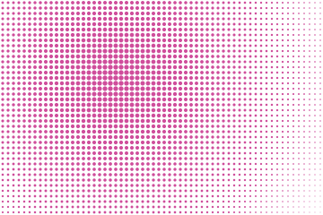
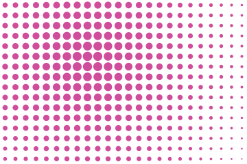
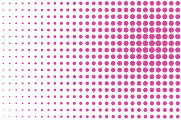

# Halftone

The lattice is even. What varies is the ink each cell carries: a dot near the light fills its
cell, a dot at the far corner shrinks to a speck. That gradient is the whole subject.


## Example

```php
<?php

declare(strict_types=1);

use Atelier\Field\Field;

require __DIR__.'/vendor/autoload.php';

echo Field::halftone(width: 360, height: 240, spacing: 13, focusX: 0.36, focusY: 0.36)->toSvg();
```

The figures use this 360 by 240 example. Only the display colour
is changed to the documentation accent. Each variant changes only the setting in its caption.

## Options

| Setting | Default | Effect |
|---|---|---|
| `width` | none | area to cover, in user units |
| `height` | none | area to cover, in user units |
| `spacing` | `13` | distance between two cells, at most a quarter of the smaller side |
| `focusX` | `0.36` | where the light stands across the frame, `[0,1)` |
| `focusY` | `0.36` | where the light stands down the frame, `[0,1)` |
| `withTheme(Theme)` | `Theme::default()` | colours, in one call |
| `withColor(string)` | `currentColor` | the ink the dots are painted with |
| `withBackground(?string)` | none | a ground behind the drawing |
| `withOpacity(?float)` | none | opacity of the whole drawing at once |

Like Moire and Rays, Halftone takes no seed: move the light and the drawing
follows, run it twice and it is the same drawing.

## Variants

One setting moved, the rest held: `spacing` is the lattice, `focusX` and `focusY` are where the light stands.

<div class="figure-grid figure-grid--notes">
<figure><figcaption><code>spacing: 6</code>. A finer lattice than spacing 13. More dots share the same frame.</figcaption></figure>
<figure><figcaption><code>spacing: 15</code>. A coarser lattice. Dots are larger and farther apart.</figcaption></figure>
<figure><figcaption><code>focusX: 0.85</code>. The same lattice with the focus moved right. The farthest corner still normalises the ramp.</figcaption></figure>
</div>

## The ramp

Distance is normalised by the farthest corner from the light, so the ramp spans the frame
wherever the light stands. The sampled dots nearest the focus have the largest radii; the
focus itself need not coincide with a lattice centre.

Cells are centred in the lattice, which puts half a cell of margin around the drawing and keeps
a dot from being cut in two on an edge.

The radius runs between six hundredths of the spacing and forty-six hundredths of it. The floor
matters: a dot with no surface leaves a hole in the lattice, and the eye reads that hole as a
defect rather than as the palest tone.
