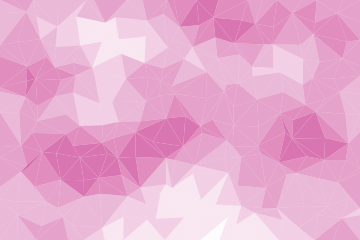

# Low poly

The vertices come from a lattice pushed off its nodes, and the diagonal of a cell turns with the
parity of that cell. Each triangle is filled flat, at the tone of the height field under its
middle.


## Example

```php
<?php

declare(strict_types=1);

use Atelier\Field\Field;

require __DIR__.'/vendor/autoload.php';

echo Field::lowPoly(width: 360, height: 240, cell: 60, tones: 6, seed: 1)->toSvg();
```

The figures use this 360 by 240 example and its explicit seed. Only the display colour
is changed to the documentation accent. Each variant changes only the setting in its caption.

## Options

| Setting | Default | Effect |
|---|---|---|
| `width` | none | area to cover, in user units |
| `height` | none | area to cover, in user units |
| `cell` | `60` | side of one cell, so two triangles |
| `tones` | `6` | distinct shades, 2 to 24 |
| `seed` | `1` | the cut and the relief under it |

Nodes on the border of the frame stay pinned, so the triangles cover the area exactly instead of
leaving a ragged margin. The cut is a partition: the triangles add up to the frame and never
overlap, which a test checks by summing their areas.

## Variants

One setting moved, the rest held: `cell` sets the facet, `tones` sets the shading.

<div class="figure-grid figure-grid--notes">
<figure><figcaption><code>cell: 20</code>. 432 facets instead of 48. Smaller cells sample the relief more often.</figcaption></figure>
<figure><figcaption><code>cell: 100</code>. 16 facets instead of 48. Larger cells give broader planes.</figcaption></figure>
<figure><figcaption><code>tones: 2</code>. The same 48 facets quantised to two tones.</figcaption></figure>
</div>

## Losing the grid

Two things are needed, and neither is enough alone.

A lattice with no jitter reads as graph paper. A lattice jittered but cut the same way every
time reads as graph paper with a hatch over it, because every diagonal runs in one direction and
the eye follows them.

What has to disappear is the grid, and the regularity of the sizes is what should remain: a
triangulation of comparable facets is what gives the style its calm.
