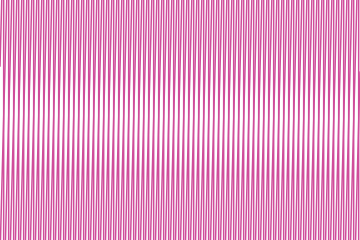
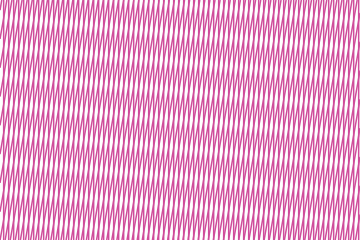
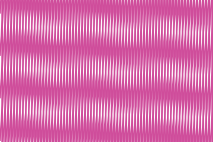

# Moire

Neither ruling holds a figure. What the eye reads is the third pattern their crossing makes:
where two lines nearly coincide the ink doubles, where they fall between one another it spreads,
and the beat between those two states sweeps across the frame at a period far longer than either
spacing.


## Example

```php
<?php

declare(strict_types=1);

use Atelier\Field\Field;

require __DIR__.'/vendor/autoload.php';

echo Field::moire(width: 360, height: 240, spacing: 5, angle: 4, duty: 0.3)->toSvg();
```

The figures use this 360 by 240 example. Only the display colour
is changed to the documentation accent. Each variant changes only the setting in its caption.

## Options

| Setting | Default | Effect |
|---|---|---|
| `width` | none | area to cover, in user units |
| `height` | none | area to cover, in user units |
| `spacing` | `5` | distance between two lines of one ruling, at most a sixth of the smaller side |
| `angle` | `4` | angle between the two rulings, in degrees, `(0,20]` |
| `duty` | `0.3` | share of the spacing a line covers, `(0,1)` |

Like Halftone and Rays, Moire takes no seed. Both rulings are ruled, and the
pattern between them follows from the two numbers that describe them.

## Variants

One setting moved, the rest held. Both rulings are ruled, so every figure here follows from its numbers.

<div class="figure-grid figure-grid--notes">
<figure><figcaption><code>angle: 1.5</code>. At spacing 5, the beat period is about 191 units: 5 divided by twice the sine of 0.75 degrees.</figcaption></figure>
<figure><figcaption><code>angle: 10</code>. At spacing 5, the same formula gives a beat period of about 29 units.</figcaption></figure>
<figure><figcaption><code>duty: 0.55</code>. Each line covers 55% of its spacing. The wider ruling darkens the frame and reduces the open gaps.</figcaption></figure>
</div>

## Two numbers that decide everything

**The angle has to stay small.** The beat sweeps at a period of roughly the spacing divided by
twice the sine of half the angle, so a degree or two spreads it over the whole frame and ten
degrees packs it into a few bands. Past twenty the two rulings simply read as a crosshatch, and
the guard says so.

**The line width is a share of the spacing, not a width of its own.** The beat is a change in
how much ink covers the surface, so a ruling drawn as thin strokes over a wide gap has almost no
coverage to change and shows almost no beat. Around three tenths the two states are far enough
apart to read, and past a half the surface saturates and the bands disappear into the ink.

## Reaching the edges

Rulings are laid along the diagonal so they still cover the frame once turned, and every line is
then cut to the frame by geometry rather than by a clip path. One line is drawn past each end,
so the ruling always overshoots and the cut decides where it stops: stopping on the last whole
spacing instead leaves a gutter against an edge, which reads as a defect beside lines this
dense.
