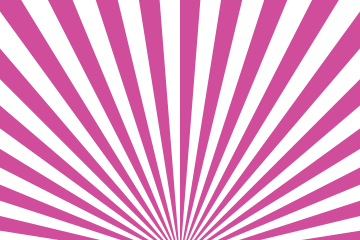
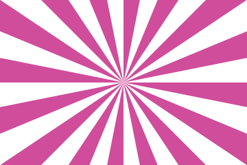

# Rays

A fan of wedges from one point. Each wedge widens with distance from that centre, so the
drawing changes across its frame instead of repeating a tile.

The centre is usually better placed outside the frame than inside. Below the bottom edge the fan
reads as a light rising behind something; in the middle of the frame it reads as a wheel.


## Example

```php
<?php

declare(strict_types=1);

use Atelier\Field\Field;

require __DIR__.'/vendor/autoload.php';

echo Field::rays(width: 360, height: 240, rays: 16, focusX: 0.5, focusY: 1.08, duty: 0.5)->toSvg();
```

The figures use this 360 by 240 example. Only the display colour
is changed to the documentation accent. Each variant changes only the setting in its caption.

## Options

| Setting | Default | Effect |
|---|---|---|
| `width` | none | area to cover, in user units |
| `height` | none | area to cover, in user units |
| `rays` | `16` | wedges around the full turn, 2 to 120 |
| `focusX` | `0.5` | where the centre stands across the frame, -1 to 2 |
| `focusY` | `1.08` | where the centre stands down the frame, -1 to 2 |
| `duty` | `0.5` | share of its own step a wedge covers, 0 to 1 |
| `withTheme(Theme)` | `Theme::default()` | colours, in one call |
| `withColor(string)` | `currentColor` | the ink the wedges are painted with |

This is one of three fields in the catalogue that takes no seed. The fan is ruled, and the four
numbers say everything about it.

A centred fan at an equal duty is the rising sun flag. Moving the centre off the middle, or
taking the duty away from a half, is enough to make the drawing say something else.

## Variants

One setting moved, the rest held: `rays` is the count, `duty` is the width of a wedge, `focusY`
is how far outside the frame the light stands.

<div class="figure-grid figure-grid--notes">
<figure><figcaption><code>rays: 40</code>. Forty wedges instead of sixteen. More rays subdivide the same angular range.</figcaption></figure>
<figure><figcaption><code>duty: 0.25</code>. A wedge covering a quarter of its step rather than half. The same count reads as a set of beams on an open ground.</figcaption></figure>
<figure><figcaption><code>focusY: 0.5</code>. The centre in the middle of the frame. Every wedge reaches the surface, so the fan closes into a wheel.</figcaption></figure>
</div>

## Reaching the edges

Each wedge is drawn past the far corner of the frame, whatever the centre, and then cut to the
frame by geometry rather than by a clip path. The group carries no identifier, so a field is
content a document can take without worrying about what is already in it.

A wedge that misses the frame entirely is dropped rather than drawn empty, which is why a centre
outside the frame gives fewer wedges than the count asks for.
