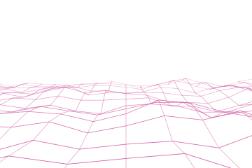
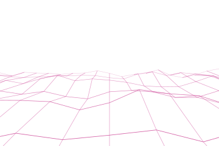
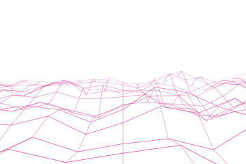
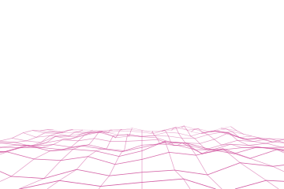

# Terrain

The wireframe landscape: a grid laid flat over a relief and seen from a little above it, receding
to a horizon.

Depth is a division. A row at depth `v` is drawn at the frame's reach over `v`, so even steps in
depth crowd on the screen the way a road does. Columns fan from the vanishing point for the same
reason, and the height a point is lifted by is scaled the same way, so a far ridge flattens
without being computed any differently from a near one.



## Example

```php
<?php

declare(strict_types=1);

use Atelier\Field\Field;

require __DIR__.'/vendor/autoload.php';

echo Field::terrain(width: 360, height: 240, rows: 15, columns: 19, horizon: 0.36, relief: 0.6, seed: 1)->toSvg();
```

The figures use this 360 by 240 example and its explicit seed. Only the display colour
is changed to the documentation accent. Each variant changes only the setting in its caption.

## Options

| Setting | Default | Effect |
|---|---|---|
| `width` | none | area to cover, in user units |
| `height` | none | area to cover, in user units |
| `rows` | `15` | rows of the lattice, 2 to 80 |
| `columns` | `19` | columns of the lattice, 2 to 80 |
| `horizon` | `0.36` | where the horizon stands down the frame, `[0,1)` |
| `relief` | `0.6` | how far a point may be lifted, 0 to 1 |
| `thickness` | `0.9` | line width of the near rows |
| `seed` | `1` | the relief under the lattice |
| `withTheme(Theme)` | `Theme::default()` | colours, in one call |
| `withColor(string)` | `currentColor` | the ink the lattice is drawn with |

A near row is drawn heavier and darker than a far one, which is the second thing the field says
about distance after the crowding. The sky above the horizon is left empty, the way the sky above
a wave stack is.

## Variants

One setting moved, the rest held: `rows` is the lattice, `relief` is the ground under it,
`horizon` is where the eye stands.

<div class="figure-grid figure-grid--notes">
<figure><figcaption><code>rows: 7</code>. Seven rows instead of fifteen. The near cells open up and the surface reads as a fold rather than as a mesh.</figcaption></figure>
<figure><figcaption><code>relief: 1</code>. The same relief lifted to the limit the guard allows, where the near ridges start crossing the rows behind them.</figcaption></figure>
<figure><figcaption><code>horizon: 0.6</code>. The horizon is 60% down the frame, leaving 40% below it for the projected ground.</figcaption></figure>
</div>

## Reaching the edges

The near row is placed below the bottom edge and the outer columns beyond the sides, so the
lattice leaves the frame on three sides instead of floating in the middle of it. Every line is
then cut to the frame by geometry rather than by a clip path, which keeps the group free of
identifiers.

A column that never enters the frame is dropped rather than drawn as an empty path. At the far
end of the lattice the outermost columns are outside on both sides, so a terrain draws fewer lines
than its counts suggest.

Clipping intersects each straight segment between samples with the frame, including crossings
whose endpoints are both outside. Curves remain sampled approximations. The clipped coordinates
reach the border; the visible stroke extends half its width beyond its centreline.

At very small row or column counts, projected lines can miss the frame entirely. A horizon
near `1` compresses the visible terrain into a narrow strip at the bottom. These settings are
accepted but need not produce a complete-looking mesh.
