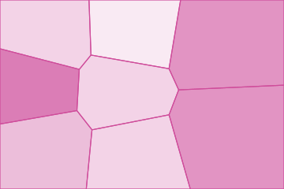
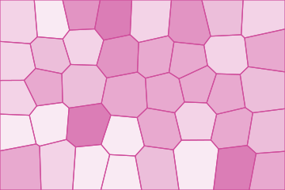

# Voronoi

Every part of the surface belongs to its nearest site. A cell is the set of points closer to one
site than to any other, obtained by cutting the frame with the perpendicular bisector of each
pair. The cells are convex and partition the frame. For sites in general position, three
cells meet at an interior vertex; boundary vertices and degenerate arrangements differ.


## Example

```php
<?php

declare(strict_types=1);

use Atelier\Field\Field;

require __DIR__.'/vendor/autoload.php';

echo Field::voronoi(width: 360, height: 240, sites: 24, relax: 2, seed: 1)->toSvg();
```

The figures use this 360 by 240 example and its explicit seed. Only the display colour
is changed to the documentation accent. Each variant changes only the setting in its caption.

## Options

| Setting | Default | Effect |
|---|---|---|
| `width` | none | area to cover, in user units |
| `height` | none | area to cover, in user units |
| `sites` | `24` | seeds thrown into the frame, 2 to 400 |
| `relax` | `2` | passes moving each site to the arithmetic mean of its cell vertices, 0 to 12 |
| `thickness` | `1.2` | line width between two cells, 0 to leave them unstroked |
| `tones` | `6` | distinct shades, 2 to 24 |
| `seed` | `1` | where the sites fall and which tone each one takes |

Fills go down before the first stroke. An edge is shared by two cells, and a fill laid down
later would eat the half of it lying on its side.

The tone of a cell is drawn rather than taken from the index of its site. Sites are laid out
lattice first, so an index carries a position, and toning by it would walk the palette across
the frame and turn the partition into a ramp.

## Variants

One setting moved, the rest held: `sites` sets the count, `relax` decides how even the cells are.

<div class="figure-grid figure-grid--notes">
<figure><figcaption><code>sites: 8</code>. Eight cells. Each one is large enough to show that every edge it has is straight.</figcaption></figure>
<figure><figcaption><code>sites: 40</code>. Forty cells. Cell size falls with the count, and the partition starts reading as a texture.</figcaption></figure>
<figure><figcaption><code>relax: 0</code>. The same 24 initial sites without relaxation. Cell sizes are more uneven.</figcaption></figure>
</div>

## Relaxing

Each relaxation pass moves a site to the arithmetic mean of its polygon's vertices, then
recomputes the partition. This tends to reduce uneven spacing. It is not an area-centroid
Lloyd iteration, and convergence to a honeycomb is not promised. The default two passes retain
irregular cell sizes.

## The one in atelier/pattern

[Pattern](https://github.com/ateliersvg/pattern) computes the same partition on a torus, so that it joins
with itself and can be used as a repeating tile. Here nothing has to join, which is exactly what
lets the sites move.
