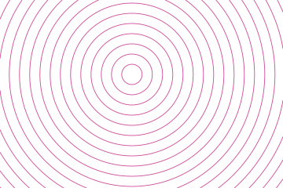
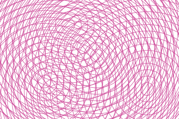
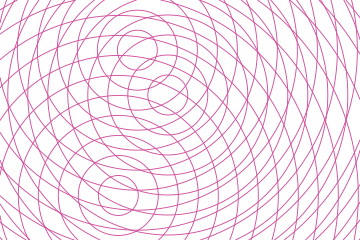

# Wave interference

Each source draws its own rings at a constant spacing. What the drawing is about is where two
sets cross: the pattern of lens shapes between them is the interference, and it belongs to no
single source.


## Example

```php
<?php

declare(strict_types=1);

use Atelier\Field\Field;

require __DIR__.'/vendor/autoload.php';

echo Field::waveInterference(width: 360, height: 240, sources: 3, spacing: 13, seed: 1)->toSvg();
```

The figures use this 360 by 240 example and its explicit seed. Only the display colour
is changed to the documentation accent. Each variant changes only the setting in its caption.

## Options

| Setting | Default | Effect |
|---|---|---|
| `width` | none | area to cover, in user units |
| `height` | none | area to cover, in user units |
| `sources` | `3` | points the rings spread from, 1 to 24 |
| `spacing` | `13` | distance between two rings of one source, at most a quarter of the smaller side |
| `thickness` | `0.9` | line width |
| `seed` | `1` | where the sources stand |

One source draws rings and nothing else: the interference needs a second set to cross. Three is
where the lens shapes start reading as a pattern of their own rather than as two overlays.

## Variants

One setting moved, the rest held: `sources` is how many sets cross, `spacing` is the ring.

<div class="figure-grid figure-grid--notes">
<figure><figcaption><code>sources: 1</code>. One source draws rings and nothing else, since a crossing needs a second set.</figcaption></figure>
<figure><figcaption><code>sources: 6</code>. Six sources instead of three. More rings cross and the drawing becomes denser.</figcaption></figure>
<figure><figcaption><code>spacing: 20</code>. The same three sources with rings 20 units apart instead of 13. Wider spacing opens the lens shapes.</figcaption></figure>
</div>

## Reaching the corners

Rings run out to the far corner of the frame, so a source near an edge still reaches the other
side rather than fading into a disc.

Each ring is then cut to the frame by geometry rather than by a clip path, which keeps the group
free of identifiers. A field is content appended to a document, and content carrying an id has
to worry about colliding with whatever is already in that document.

Sources keep clear of the border, where most of their rings would fall outside the frame and the
crossing would have nowhere to happen.

Clipping intersects each straight segment between samples with the frame, including crossings
whose endpoints are both outside. Curves remain sampled approximations. The clipped coordinates
reach the border; the visible stroke extends half its width beyond its centreline.
